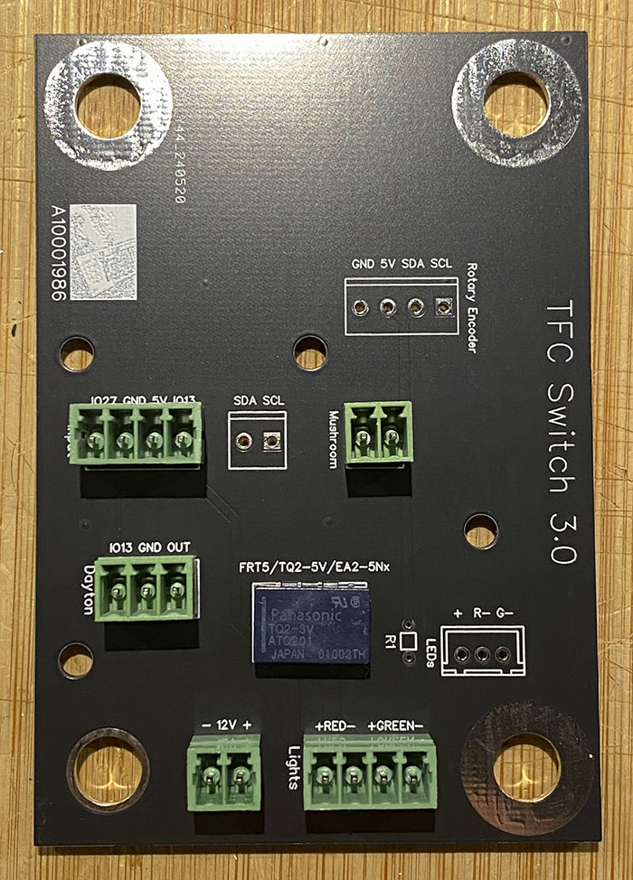
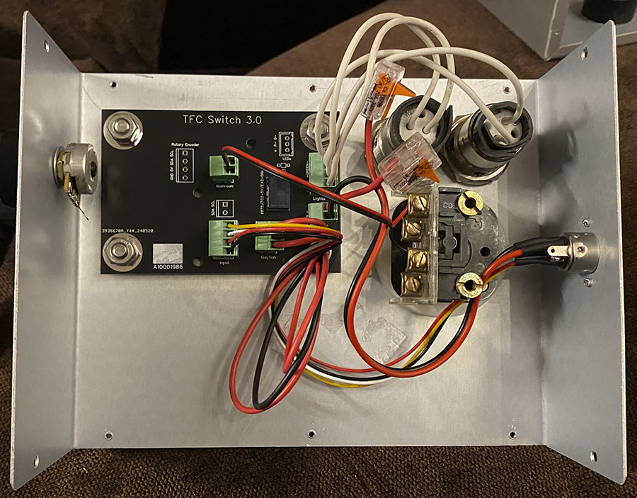
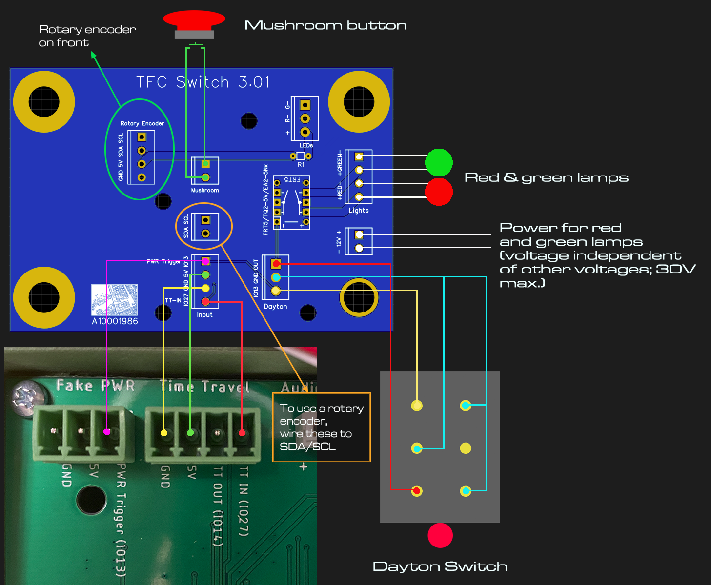

Pictures show version 3 of the TFC board. Version 4 adds two potential-free contacts for switching external gear through the Dayton switch.

To have [JCLPCB](https://jlcpcb.com) make your TFC Switch PCB:
1) Create an account at jlcpcb.com
2) Click "Upload Gerber file" or "order now"
3) Upload the "Gerber..." file (.zip, do not decompress!); leave all options at their defaults. You can choose a PCB color though...
4) Do NOT activate "PCB assembly"; click on "Save to Cart"
5) Finalize your order

Additionally to the PCB, you need:
- 1x [Panasonic TQ2-5V](https://www.mouser.com/ProductDetail/Panasonic-Industrial-Devices/TQ2-5V?qs=HLLy2pIPwutHaTSpVfb1kw%3D%3D) or [Kemet EA2-5Nx](https://www.mouser.com/ProductDetail/KEMET/EA2-5NU?qs=UeqeubEbzTX2QGWq8LyCiw%3D%3D) or FRT5-5V mini relay
- 3x TE Connectivity [284514-4](https://www.mouser.com/ProductDetail/TE-Connectivity/284514-4?qs=woBvfblj%2Fzy48ih9AmO90g%3D%3D) (+1 for rotary encoder)
- 3x TE Connectivity [284506-4](https://www.mouser.com/ProductDetail/TE-Connectivity/284506-4?qs=pW%2FyRk%2FT1EFUJ80efaE%2FeA%3D%3D) (+1 for rotary encoder)
- 1x TE Connectivity [284514-3](https://www.mouser.com/ProductDetail/TE-Connectivity/284514-3?qs=woBvfblj%2FzwGS50caoQlYA%3D%3D) (+1 when using the "LEDs" connector)
- 1x TE Connectivity [284506-3](https://www.mouser.com/ProductDetail/TE-Connectivity/284506-3?qs=pW%2FyRk%2FT1EErkHTioRHy7Q%3D%3D) (+1 when using the "LEDs" connector)
- 2x TE Connectivity [284514-2](https://www.mouser.com/ProductDetail/TE-Connectivity/284514-2?qs=woBvfblj%2FzwP8grZOAh0Gg%3D%3D) (+1 for rotary encoder)
- 2x TE Connectivity [284506-2](https://www.mouser.com/ProductDetail/TE-Connectivity/284506-2?qs=pW%2FyRk%2FT1EEEaP6r3xD3uw%3D%3D) (+1 for rotary encoder)

For the red and green lamps, there are two ways to connect them: 
1) 12V (or higher; max. 30V) powered. In this case, use the "Lights" connector as shown in the diagram, and connect your power source to the the "12V" connector.
2) 5V (or below) powered. In this case, put a suitable resistor on R1 (or a wire bridge, if your LEDs/lamps are 5V driven), and connect your LEDs/lamps to the "LEDs" connector.

Aux 1 and Aux 2 are shorted when the Dayton is switched to "ON", and opened with switched to "OFF". You can connect any external gear here, like eg. the roff console (in case you want it to be switched through the Dayton).

_Text & images: (C) Thomas Winischhofer ("A10001986"). See LICENSE._ Source: https://tfc.out-a-ti.me
