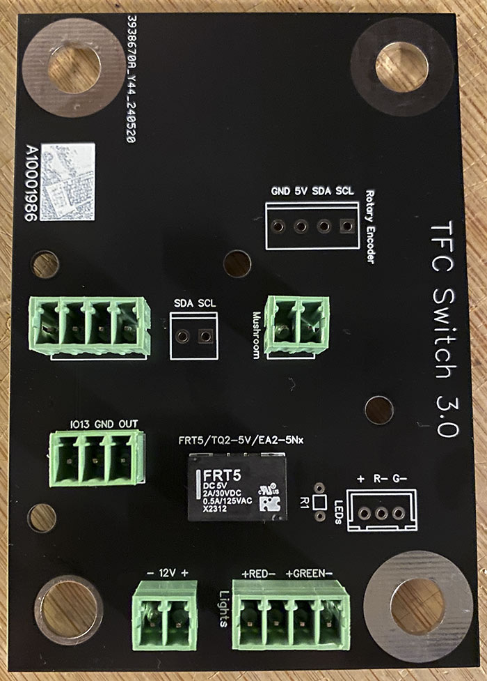

To have [JCLPCB](https://jlcpcb.com) make your TFC Switch PCB:
1) Create an account at jlcpcb.com
2) Click "Upload Gerber file" or "order now"
3) Upload the "Gerber..." file (.zip, do not decompress!); leave all options at their defaults. You can choose a PCB color though...
4) Do NOT activate "PCB assembly"; click on "Save to Cart"
5) Finalize your order

