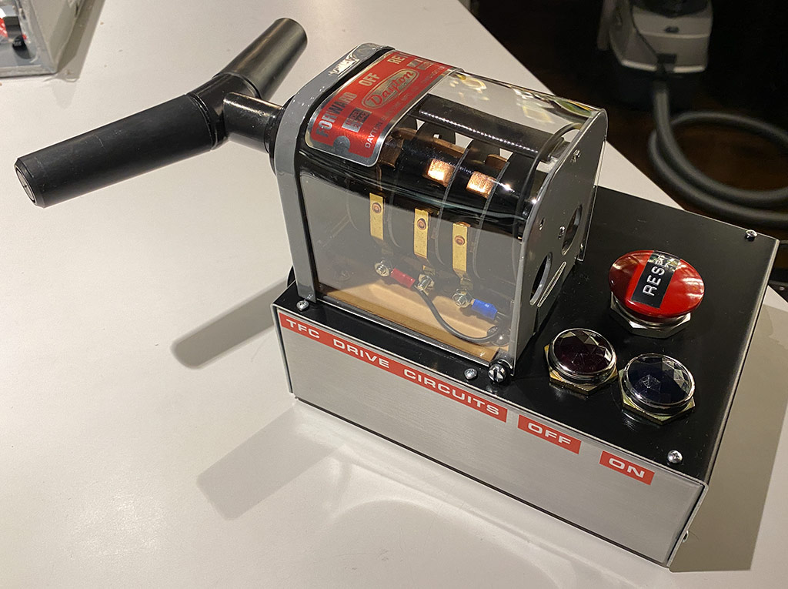
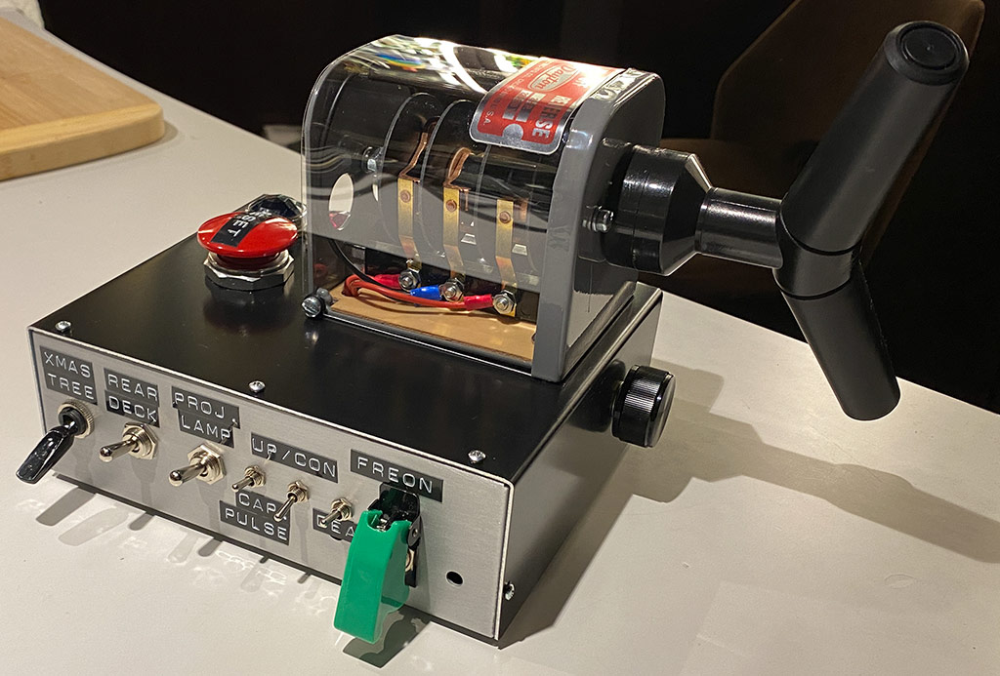
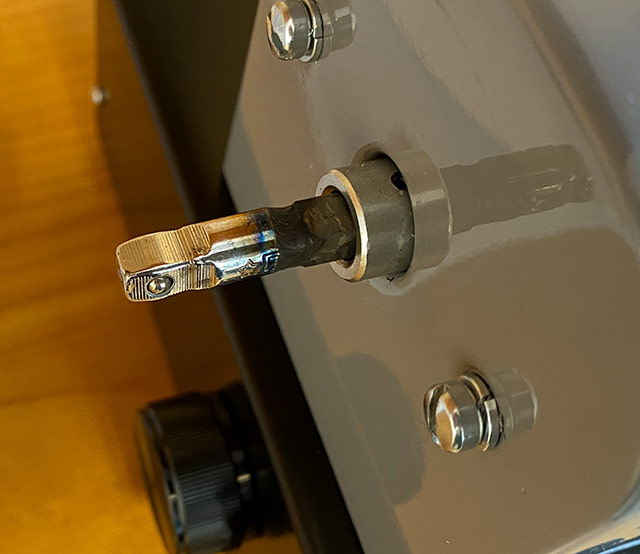
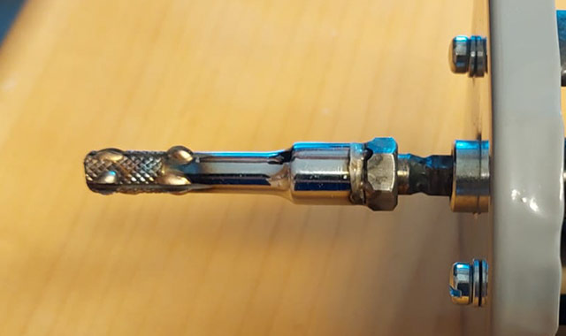
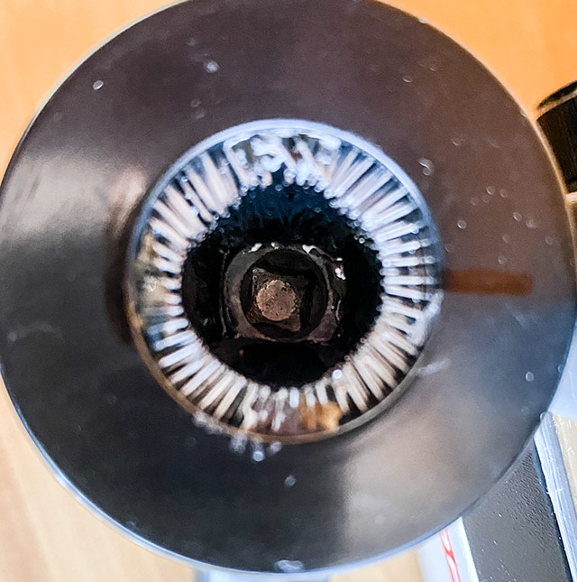
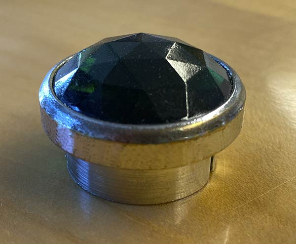

# TFC Switch

This repo holds some instructions for building a TFC Drive Switch as known from the Delorean Time Machine.

This switch is fully compatible with CircuitSetup's [Time Circuits Display](https://tcd.out-a-ti.me) kit. Rotating the handle fake-powers on/off the TCD, and the "RESET" mushroom button triggers a time travel.

I tried to build it exactly like in the movies, which turned out to be a bit difficult as this switch looks different in all of the cars used in the movies. The one currently on exhibition in the [Petersen Museum](https://www.petersen.org/back-to-the-future-dmc-delorean) is the restored A-car, so it *should* be the most authentic one. However, it appears that, during restoration, the switch was taken out of a different car, as it is clearly not the one shown in the very first time travel scene (where Einstein travels one minute into the future, and Doc explains the Time Circuits to Marty). The box looks different, the labels are at different locations, and some more minor differences. Also for the back side, which is hardly ever visible in Part I (only at the end, when Marty waits for the alarm to go off), looks different in every time, as does the knob at the very front of the box.

After some consideration, I decided to go for the version shown first in the movies, ie in said scene with Einstein.

List of components and remarks:

### Box 

While for the cars shown later in the series and the one now in the Petersen Museum, they apparently used a Radio Shack 270-274, the box shown in the beginning of Part I looks a bit different. However, the Radio Shack version is no longer available.

[CircuitSetup](https://circuitsetup.us/product/tfc-drive-switch-aluminum-enclosure/) offers pre-cut/drilled boxes now. 

When I built my switches, those weren't available either. So I used a Teko model 384, which is approx. 7mm shorter and 7mm lower than the Radio Shack one. 
- https://www.reichelt.at/us/en/aluminium-housing-203x160x70-mm-teko-384-p21197.html?r=1
- https://www.teko.it/uploads/manuali/pdf/384.pdf
- https://www.soselectronic.com/en/products/teko/384-18-298999
- https://www.anteipaolucci.it/contenitori-metallici/contenitore-in-alluminio-203x160x695mm-teko-384-7838.html#

### Dayton Switch

These switches are still made and available at [Grainger](https://www.grainger.com/product/DAYTON-Drum-Switch-Maintained-Reversing-2X442).

For the screws that hold it in place, I used [these](https://www.accu.co.uk/slotted-round-head-screws/368952-SFB-1-4-20-1-2-A2). 

Since the switch comes with a different type label, I sourced some replica stickers on ebay and attached them to a custom made aluminum plate. Dimensions are 88.0x32.0x0.5mm, corner radius 4mm.

The acrylic glass is 102mm wide, and some 250mm in overall length. I bent it using a heat gun (160-170°C/320°F) and used the Dayton's original metal enclosure as a kind of mold; Put the metal enclosure, a suitable piece of acyrlic and a flat piece of wood into a machine vice, and carefully heat the acrylic (by moving the heat gun sideways, like in stripes) to bend it evenly over the metal. Then cut off excess material (using a box cutter; with minimum pressure cut along the line a few times, then break the glass over a sharp edge). When drilling holes, use a HSS (metal) drill (which should not be new, use it on metal a couple of times beforehand), and drill at very low speed, with minimum pressure on the material. Also, don't forget to put some paper tape on the back side before drilling, this will prevent cracks. 

The most difficult part is attaching the handle.

The handle itself is a battery contact cleaner in real life, going under the name "Lynx" sometimes, and can be bought at [pepboys](https://www.pepboys.com/lynx-battery-brush/product/9405475) in the US, or [at bikeshops](https://www.biketeile-service.de/en/electrics/battery/accessoriesforbatteries/3in1batterypostandterminalcleaner.html) in Germany. The one I got from the shop in Germany is [this one](https://www.lampa.it/en/articles/70021-3-in-1-battery-post-and-terminal-cleaner). They sometimes come with white covers which then obviously need painting.

In order to attach the handle to the switch, I bought a 1/4 inch drive extension set, cut one of those extensions in two parts and welded the male part, approx. 1.5cm in length, to the switch, right on top of the existing square end of the axle. Since the connection between male and female parts of this extension set was too loose for my taste, I welded a nut on top of the female end, and drilled out the thread so the nut holds the axle with the male end better in place. Then I adjusted the female part in length so that it fits exactly into the handle and its rear end touches the end of the handle's inside. That part also got some excess weld points and a few superficial cuts using a cutting disc, in order to make the surface as rough as possible. The final step was to pour some epoxy resin into the handle, immediately put the female part in and ... wait. I repeated that process until the epoxy level was close the the top of the metal part. Beware: There is a hole in the handle on the side of the golden brush where resin might flow out in the process; cover this with tape before starting.

In order to reduce stress on the handle when turning the switch, I exchanged the spring with a weaker one. Also, I added a washer at the rear end of the switch's axle in order to keep it better in place; without the washer, the small wheel inside the retention mechanism sometimes fell out when turning the switch.

### Mushroom button
Allen-Bradley 800T-D with 800T-XA switch block. This needs a bunch of washers to fix it in place; I used thick plastic washers to keep the weight down.

### Lights
Dialco (Dialight) vintage faceted green and red pilot light, 1" diameter. Good luck finding a green one ;)

### Pot button
Leviton 402-6616 Black (not depicted here)

The pot knob does nothing on my switches, but it could be attached to a [rotary encoder](https://github.com/realA10001986/Time-Circuits-Display/blob/main/README.md#rotary-encoder) to set the speed on the speedometer. This requires two additional wires from/to the TCD (SDA, SCL for i2c connection; please consider cross-talk when choosing a cable). I didn't do that because that knob is not easily accessible, given its location below the handle.

### Switches

The side switches are standard toggle switches, in different sizes. I have no specific model for recommendation.

### Electronics

Not much of "electronics" inside; this switch is really only a switch that connects two wires for the TCD fake power when turning the Dayton switch, and two other wires when pressing the Mushroom button.

I made a small PCB acting as a switch board, using a FRT5-5V (or Panasonic TQ2-5V, or Kemet EA2-5Nx) mini relay for the lights; I used 12V GU5.3 LED bulbs for the green and red lights since low power standard LEDs were too weak for those thick Dialight lenses. (If you want to use LEDs with up to 5V voltage, you can connect them to the "LEDS" terminal and put a suitable resistor at R1.)

Gerbers and EasyEDA file is in the [Electronics](https://github.com/realA10001986/TFC-Switch/tree/main/Electronics) folder here. [JLCPCB](https://jlcpcb.com/) can make it for you; just create an account and upload the Gerber file. Then choose PCB color but leave the other production parameters at their default.

### Labels

- Rotex 880 or Dymo Office Mate II Label Maker 1540, with suitable font wheel
- Back side: 9mm (3/8"): "XMAS", "TREE", "REAR", "DECK", "PROJ.", "LAMP", "UP/CON", "CAP.", "PULSE", "DEAD", "FREON"
- Mushroom: 12mm (1/2"): "RESET"

For the red labels on the driver's side, see the [Labels](https://github.com/realA10001986/TFC-Switch/tree/main/Labels) folder in this repository.

